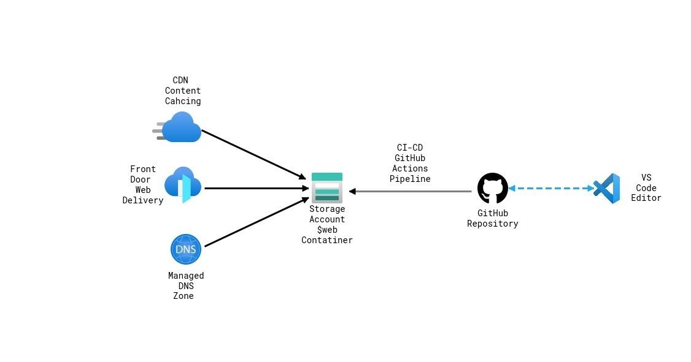

# Personal Site

This project serves as my personal webiste to host my resume, projects, certifications, contact information, and links to connect with me in other ways. The site its self is hosted in an Azure storage acount $web container. The name servers are also hosted on Azure in a managed DNS zone with Azure Front Door for delivery and Content Delivery Network profile for content caching. To ensure all changes to the site are kept up to date with what is hosted online, A ci/cd pipeline from GitHub is implemented using a workflow.

## Architecture

